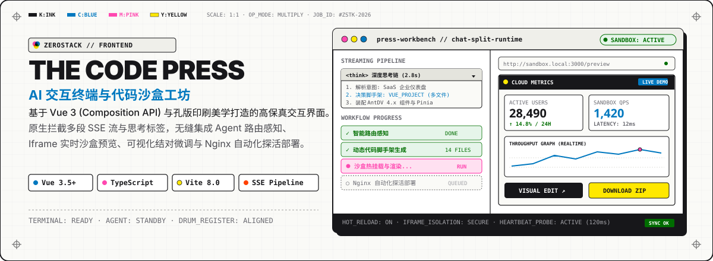
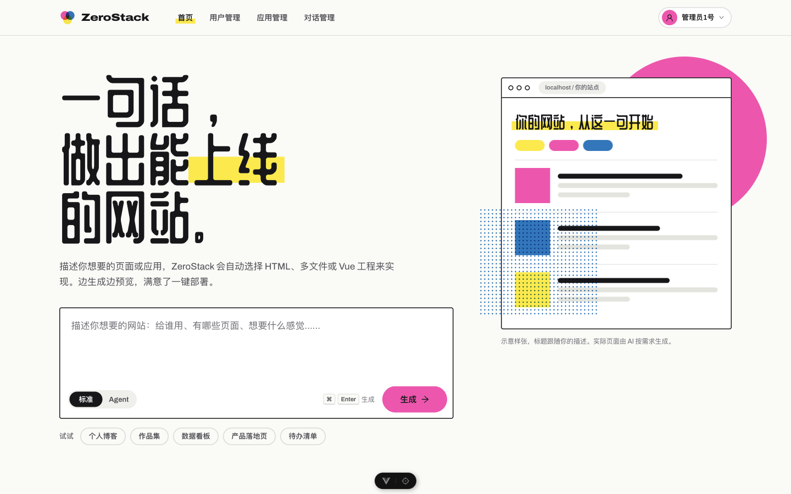
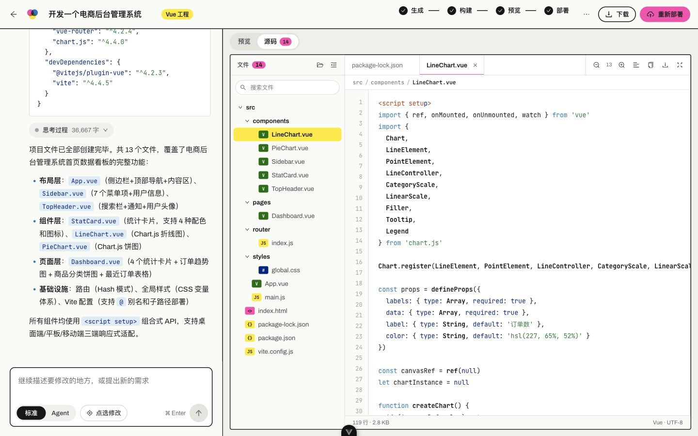
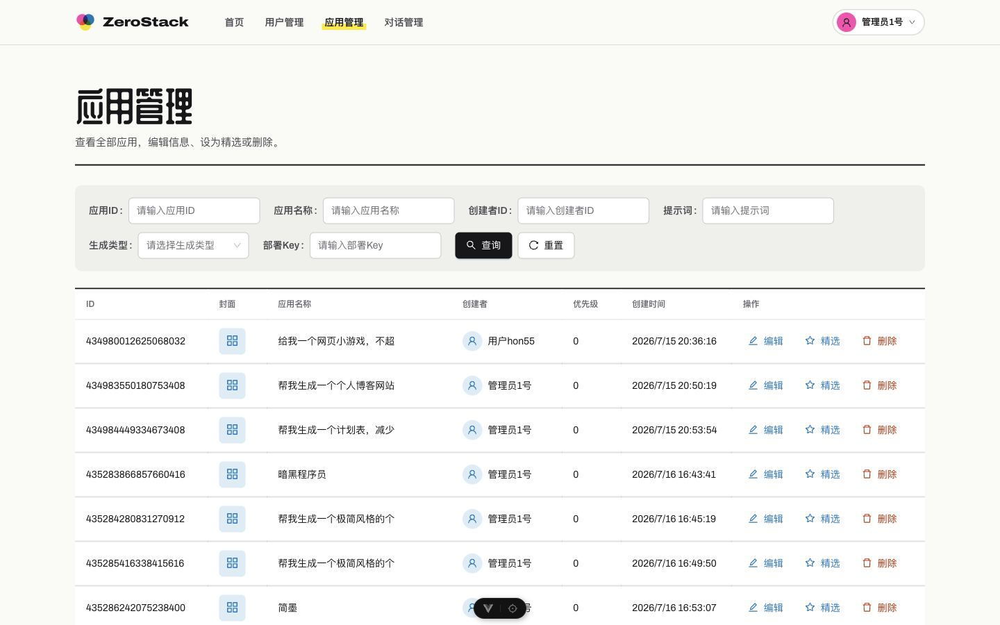
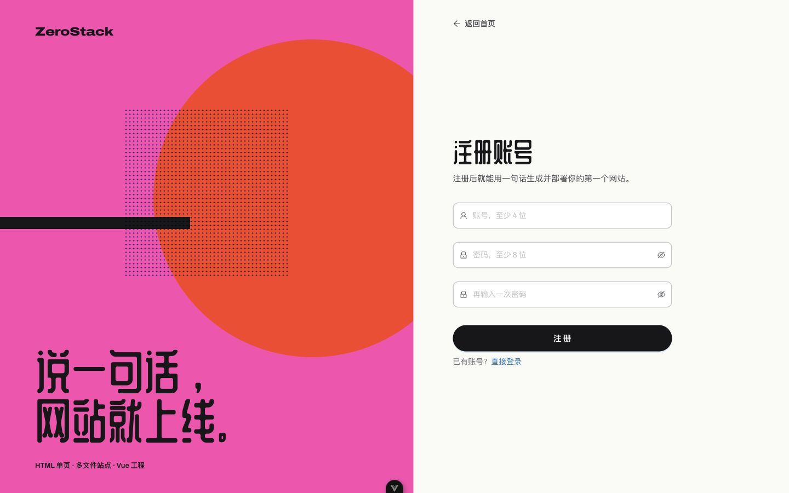
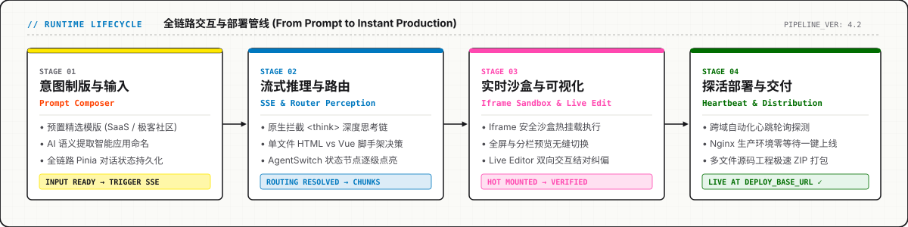
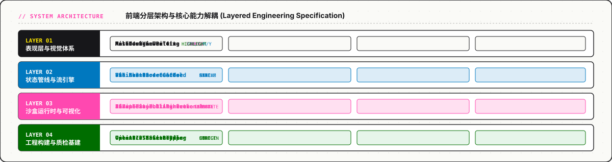

<p align="center">
  
</p>

<p align="center">
  
  
  
  
  
  
</p>

---

## 概述

**ZeroStack Frontend** 是面向全栈开发者与 AI 应用创作者的现代化交互终端。项目采用 **Vue 3 (Composition API)** 与 **TypeScript** 构建，并在视觉层深度融合了 **Risograph (孔版印刷)** 的物理工坊美学。

系统不只是常规的控制台，而是将自然语言意图、Agent 推理过程、智能路由调度、实时隔离沙盒与生产一键上线紧密缝合的一体化工作台。

---

## 界面实机预览 (Interface Showcase)

### 1. 核心工坊主页与样张机台
主页采用孔版印刷机床（Press Bed）隐喻，结合动态印版缓动（Pointer Drift）与多套行业预设场景。

<p align="center">
  
</p>

---

### 2. 实时流式对话与工程代码沙盒
支持原生多段 SSE `<think>` 思考折叠渲染、智能路由决策感知、双向可视化微调与多文件源码树审查。

<table>
  <tr>
    <td width="50%">
      <p align="center"><strong>实时分栏对话与运行沙盒</strong></p>
      
    </td>
    <td width="50%">
      <p align="center"><strong>多文件工程代码审查与编辑</strong></p>
      
    </td>
  </tr>
</table>

---

### 3. 全局管理控制台与鉴权中心
具备基于角色的访问控制（RBAC）体系，统一覆盖应用生命周期运营与极客风格登录体验。

<table>
  <tr>
    <td width="50%">
      <p align="center"><strong>全局应用管理控制台</strong></p>
      
    </td>
    <td width="50%">
      <p align="center"><strong>孔版印刷风格鉴权登录页</strong></p>
      
    </td>
  </tr>
</table>

---

## 工作流管线

从自然语言 Prompt 到即时生产可用的应用，系统划分为四个高内聚的生命周期阶段：

<p align="center">
  
</p>

1. **意图制版 (Prompt Composer)**：预设多套典型业务场景（SaaS 仪表盘、极客社区、营销主页），利用语义推理自动提炼应用标题，并通过 Pinia 实现对话状态的云端持久化。
2. **流式推理与路由 (Streaming Engine)**：原生解析 SSE 事件流，截获并结构化折叠 `<think>` 深度思考标签；实时感知模型做出的脚手架路由决策（单文件 HTML 运行时 vs 多文件工程脚手架），并驱动 `AgentSwitch` 节点逐级点亮。
3. **实时沙盒与可视化 (Live Sandbox & Editor)**：通过安全的 `iframe` 容器挂载动态生成的代码与样式资源，提供分栏与全屏实时热重载预览；提供可视化编辑入口，支持针对局部组件与大模型结对调优。
4. **探活部署与交付 (Heartbeat & Distribution)**：内置跨域心跳自动化轮询探活引擎，精准抹平 Nginx 静态托管发布的时间差；支持将完整代码工程直接打包为 ZIP 源码包导出。

---

## 核心系统架构

项目采用清晰的分层解耦设计，严格隔离视觉呈现、流式通信、运行时隔离与构建质检：

<p align="center">
  
</p>

### 1. 表现层与 Risograph 视觉体系
- **四色专色鼓轮 (Four Drums)**：基于 Ink (`#17171A`)、Blue (`#0078BF`)、Pink (`#FF48B0`)、Yellow (`#FFE800`) 构建基础色板，通过 CSS 叠印（`mix-blend-mode: multiply`）模拟物理孔版印刷质感。
- **动态印版光标缓动**：通过 `usePointerDrift` 捕获光标动能，使主样张底衬呈现毫秒级的微错位（Drifting），在生成完毕后精确归位至套准位置（Registration Mark）。
- **组件级 Token 重构**：深度覆盖 Ant Design Vue 的原生 Design Tokens，消除常规管理系统的通用感，保持硬朗克制的工业排印。

### 2. 状态管线与流引擎
- **原生 SSE 与思考流解析**：深度拦截大模型响应中的 `<think>` 标签，将其渲染为独立可折叠、具备运行耗时统计的多段面板，保持主对话流的阅读节奏。
- **业务异常无缝下发**：SSE 底层监听器原生拦截后端推送的 `business-error`（例如频次限流、安全审查阻断），即时提供轻量提示，避免前端状态撕裂或意外重连。
- **RBAC 鉴权与全局路由守卫**：内置完整的基于角色路由系统，隔离普通对话用户中心与全局系统运营监控。

### 3. 沙盒执行引擎与可视化修改
- **安全沙盒运行时 (`Iframe Sandbox`)**：为大模型实时生成的脚本与 DOM 结构提供隔离执行空间，支持自动探测资源挂载完成事件。
- **双向可视化结对 (`Live Editor`)**：支持用户直接在界面上对生成的沙盒视图进行交互式检查，并将修改意图再次反馈给模型完成精细迭代。
- **跨域轮询探测**：后端触发 Nginx 一键部署后，前端探活机制以指数退避方式持续轮询目标节点状态，确保页面在服务器准备就绪的第一时间平滑刷新。

---

## 快速启动指南

### 1. 环境准备
确保本地安装有 Node.js 运行环境（推荐 `>= 22.18.0` 或 `>= 24.12.0`）。

```bash
cd frontend
npm install
```

### 2. 环境变量配置
在 `src/config/env.ts` 或 `.env` 文件中确认服务端与部署地址：

```typescript
// 后端 REST & SSE 基础接口
export const API_BASE_URL = 'http://localhost:8080/api'

// Nginx 一键部署托管域名前缀
export const DEPLOY_BASE_URL = 'http://localhost:8080'
```

### 3. 本地启动开发
```bash
npm run dev
```
启动成功后，浏览器访问 Vite 提供的本地热更新调试地址。

---

## 脚本与工程规范

工程配置了完备的质量校验与自动代码生成工具链：

| 命令 | 说明 |
| :--- | :--- |
| `npm run dev` | 启动本地 Vite 开发服务器，支持毫秒级 HMR |
| `npm run type-check` | 执行 `vue-tsc --build` 进行严苛的全量类型校验 |
| `npm run lint` | 依次执行 `oxlint` 极速排查与 `eslint --fix` 深度纠偏 |
| `npm run format` | 调用 Prettier 统一前端源代码排版 |
| `npm run build` | 并行执行类型检查与生产级 Rollup 打包 |
| `npm run openapi2ts` | 基于后端 OpenAPI / Swagger Schema 自动化生成强类型客户端契约 |

---

## 目录结构速览

```text
frontend/
├── assets/
│   └── readme/          # GitHub 主页专属视觉资产 (SVG 图表与实机高保真截图)
├── src/
│   ├── api/             # OpenAPI 生成的前端强类型 API 客户端
│   ├── assets/          # 全局样式系统 (base.css Riso Tokens, global.css)
│   ├── components/      # 核心组件库 (BrandMark, AgentSwitch, MarkdownViewer)
│   │   ├── chat/        # 深度思考折叠、流式气泡、沙盒外壳组件
│   │   └── home/        # 印刷工坊首页组件 (PressBed, ProofSheet, ProofPlates)
│   ├── composables/     # 逻辑复用组合式函数 (usePointerDrift, useSSE 等)
│   ├── config/          # 运行时环境与网络通信配置
│   ├── layouts/         # 基础与分栏排版布局容器
│   ├── pages/           # 页面路由视图 (HomeView, AppChatPage, AppEditPage 等)
│   └── stores/          # Pinia 全局状态中心 (对话上下文、认证会话)
├── vite.config.ts       # Vite 构建与服务代理配置
└── package.json         # 项目依赖与运行脚本清单
```
